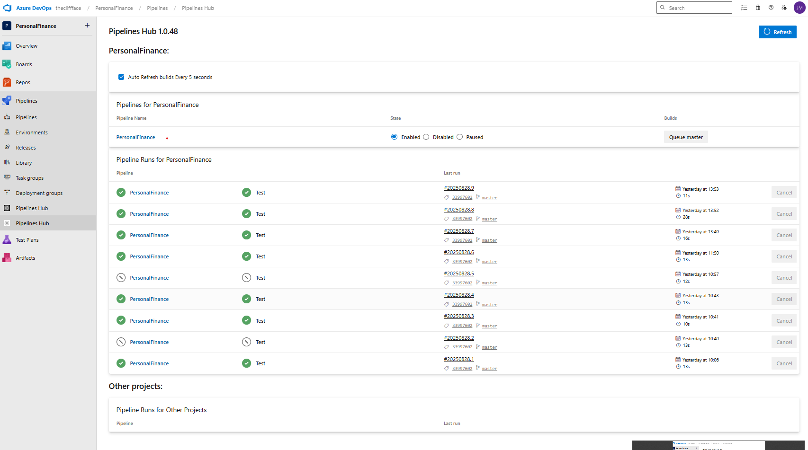

# Build and Pipelines Hub Extension

## Overview
This is a simple extension to gather some frequent commands, and information into one screen for azure devops pipelines.

In one screen you can see which pipelines have been triggered, which are running currently, which have failed, and cancel them. It prioritizes pipeline runs for the current project, whilst allowing you to also see pipelines running for other projects, and cancel them if they are blocking your build. 

Sample screenshot:

## Feedback & Questions
Please use the issues tracker in the home repo: https://github.com/TheCliffFace/azure-devops-build-hub/issues

## Release Notes

### 1.0.46
Initial public release